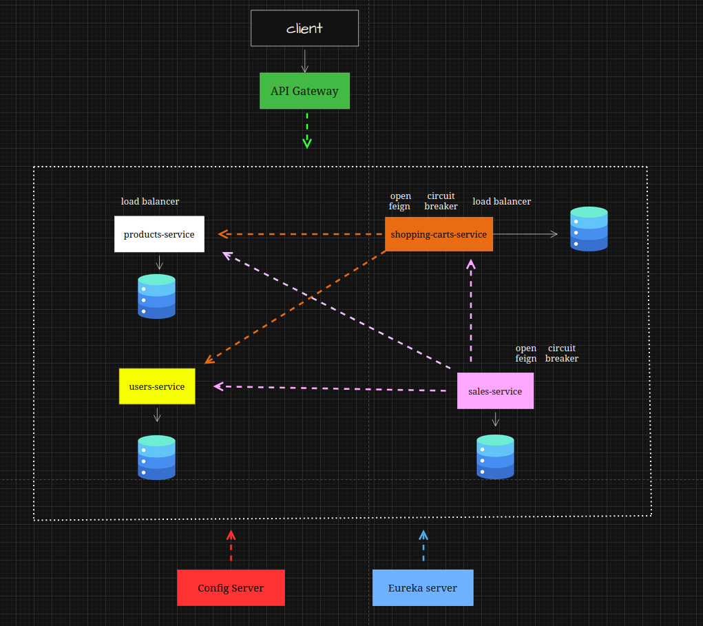

# 🛒 Online Store

<br>

## Overview

This project is an **online home appliances store** developed using a **microservices architecture**.  
It simulates the backend of a real e-commerce platform, enabling the management of users, products, shopping carts, and sales.

The main goal of this project is to demonstrate the design and implementation of a **distributed system**, applying best practices and patterns commonly used in professional environments.

This repository serves as the **general entry point** to the system.  
Each microservice has its own repository and detailed documentation.

> 📌 This project corresponds exclusively to the **backend** and runs in a **local environment**.

---

<br>

## General Architecture

The system is composed of multiple **independent microservices**, each responsible for a specific business capability and owning its own database.

Key architectural characteristics:
- **100% REST** communication
- **Service Discovery & Registry** with Eureka
- **Centralized configuration** via Spring Cloud Config Server
- **API Gateway** as a single entry point
- **Database per Service** pattern
- Local execution using **Docker Compose**



---

<br>

## Microservices

| Microservice | Responsibility | Repository |
|--------------|----------------|------------|
| shopping-cart-service | Shopping cart management | 🔗 [link](https://github.com/matias-devv/online-store-shopping-carts-service) |
| sales-service | Sales processing | 🔗 [link](https://github.com/matias-devv/online-store-sales-service) |
| users-service | User management | 🔗 [link](https://github.com/matias-devv/online-store-users-service) |
| products-service | Product catalog | 🔗 [link](https://github.com/matias-devv/online-store-products-service) |
| api-gateway | Request routing | 🔗 [link](https://github.com/matias-devv/online-store-api-gateway) |
| eureka-server | Service registry and discovery | 🔗 [link](https://github.com/matias-devv/online-store-eureka-server) |
| config-server | Centralized configuration | 🔗 [link](https://github.com/matias-devv/online-store-config-server) |

Each microservice has its own repository with detailed technical documentation.

---

<br>

## API Gateway

The **API Gateway** acts as the **single entry point** to the system.

Current responsibilities:
- URL routing to the corresponding microservices
- Service resolution through Eureka

Access example:  
http://localhost:8080/products-service/products/find-all

At this stage, the gateway is used exclusively for routing, leaving room for future enhancements.

---

<br>

## Technologies Used

- **Java 17**
- **Spring Boot**
- **Spring Cloud**
  - Eureka Server
  - Config Server
  - API Gateway
- **REST APIs**
- **MySQL**
- **Docker & Docker Compose**

---

<br>

## Configuration Management

Microservice configuration is centrally managed using **Spring Cloud Config Server**.

- Each microservice has its own YAML configuration file
- Configuration is stored in a dedicated repository
- Enables scalability and consistency across services

---

<br>

## Local Execution

The entire system can be executed locally using **Docker Compose**.

This approach allows the full microservices architecture to be started in an integrated way, including:

- API Gateway  
- Eureka Server (Service Discovery & Registry)  
- Config Server  
- Business microservices  
- Databases associated with each microservice  

<br>

### Prerequisites

- Git
- Docker

<br>

### Running the system

From the root of this repository, run:

```bash
docker compose up --build
